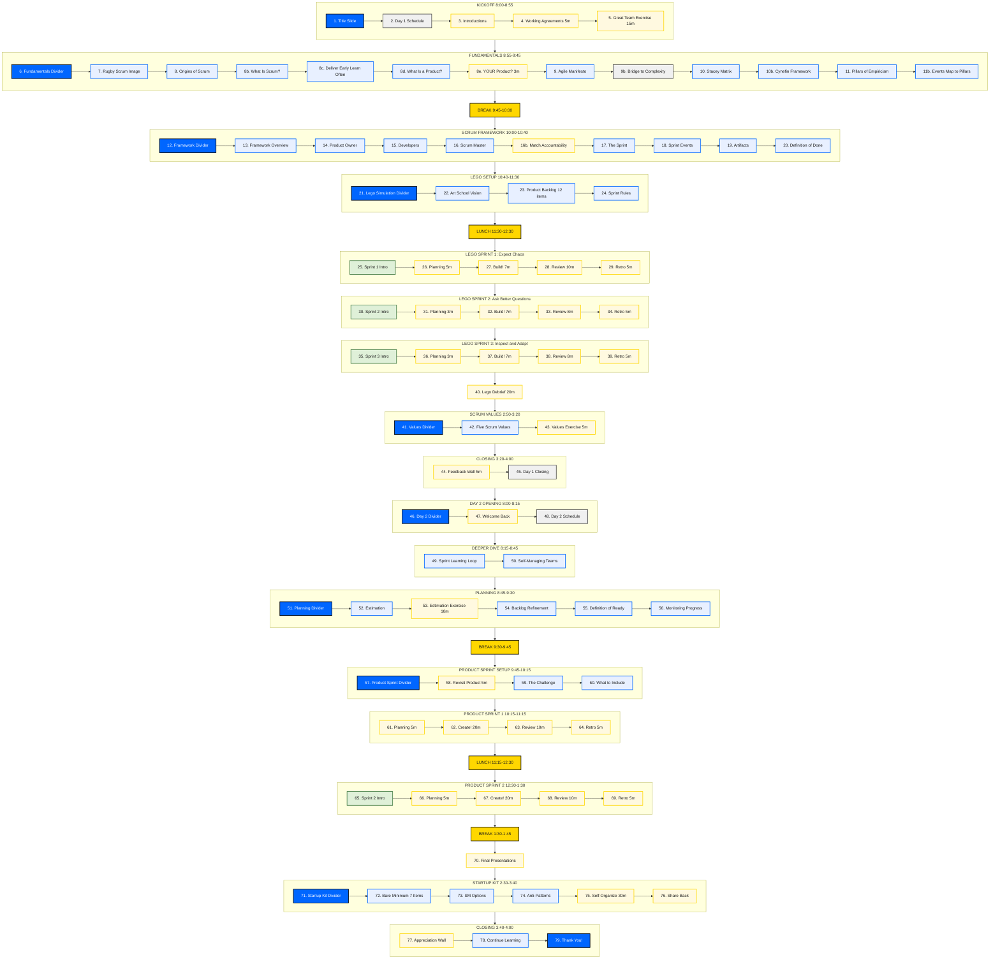

# Scrum Workshop -- Complete Slide Flow

Every slide in the workshop, organized by day and section.
Use this diagram for refinement work before the March 18-19, 2026 training.

## Legend

| Color | Meaning |
|-------|---------|
| Blue fill (`divider`) | Section dividers |
| Light blue fill (`theory`) | Theory / concept slides |
| Yellow fill (`exercise`) | Exercises, activities, hands-on work |
| Light green fill (`sprint`) | Sprint intro slides |
| Gold fill (`breakslide`) | Breaks and lunch |
| Gray fill (`transition`) | Transition / schedule slides |

## Complete Flow -- Day 1 and Day 2

## Slide Inventory

### Day 1: Learn by Building (45 slides)

| # | Slide | Type | Time | Section |
|---|-------|------|------|---------|
| 1 | Title Slide: Scrum Workshop | Divider | -- | Kickoff |
| 2 | Day 1 Schedule | Transition | ~2 min | Kickoff |
| 3 | Introductions: Name, Role, Creative Project | Exercise | ~15 min | Kickoff |
| 4 | Working Agreements: Ground Rules on Sticky Notes | Exercise | 5 min | Kickoff |
| 5 | Characteristics of a Great Team | Exercise | 15 min | Kickoff |
| 6 | Section Divider: Fundamentals of Scrum | Divider | ~30 sec | Fundamentals |
| 7 | Rugby Scrum Image | Theory | ~1 min | Fundamentals |
| 8 | Origins of Scrum: Takeuchi and Nonaka (1986) | Theory | ~3 min | Fundamentals |
| 8b | What Is Scrum? (Scrum Guide Definition) | Theory | ~3 min | Fundamentals |
| 8c | Deliver Early, Learn Often (Traditional vs Incremental) | Theory | ~2 min | Fundamentals |
| 8d | What Is a Product? (ArtWod Examples) | Theory | ~2 min | Fundamentals |
| 8e | What Is YOUR Product? (Sticky Note) | Exercise | 3 min | Fundamentals |
| 9 | Agile Manifesto: 4 Values | Theory | ~3 min | Fundamentals |
| 9b | Bridge: Values to Complexity | Transition | ~1 min | Fundamentals |
| 10 | Stacey Matrix: Complexity of Product Development | Theory | ~5 min | Fundamentals |
| 10b | Cynefin Framework | Theory | ~3 min | Fundamentals |
| 11 | Three Pillars of Empiricism (SVG diagram) | Theory | ~3 min | Fundamentals |
| 11b | How Scrum Events Use Empiricism (table) | Theory | ~3 min | Fundamentals |
| -- | **BREAK** | -- | 15 min | -- |
| 12 | Section Divider: The Scrum Framework | Divider | ~30 sec | Framework |
| 13 | Fitting the Pieces Together (circular flow SVG) | Theory | ~3 min | Framework |
| 14 | Product Owner | Theory | ~3 min | Framework |
| 15 | Developers | Theory | ~3 min | Framework |
| 16 | Scrum Master | Theory | ~3 min | Framework |
| 16b | Match the Accountability (drag-and-drop exercise) | Exercise | ~5 min | Framework |
| 17 | The Sprint | Theory | ~3 min | Framework |
| 18 | Sprint Events (4-card grid) | Theory | ~3 min | Framework |
| 19 | Artifacts and Commitments (3-card grid) | Theory | ~3 min | Framework |
| 20 | Definition of Done | Theory | ~2 min | Framework |
| 21 | Section Divider: Lego Sprint Simulation | Divider | ~1 min | Lego Setup |
| 22 | Product Vision: Build an Art School Campus | Theory | ~3 min | Lego Setup |
| 23 | Product Backlog: 12 Items with Story Points | Theory | ~3 min | Lego Setup |
| 24 | Sprint Rules: Timeboxes | Theory | ~2 min | Lego Setup |
| -- | **LUNCH** | -- | 60 min | -- |
| 25 | Sprint 1 Intro: Expect Chaos | Sprint | ~1 min | Lego Sprint 1 |
| 26 | Sprint 1 Planning | Exercise | 5 min | Lego Sprint 1 |
| 27 | Sprint 1 Build! | Exercise | 7 min | Lego Sprint 1 |
| 28 | Sprint 1 Review: "Show Me My Campus!" | Exercise | 10 min | Lego Sprint 1 |
| 29 | Sprint 1 Retrospective | Exercise | 5 min | Lego Sprint 1 |
| 30 | Sprint 2 Intro: Ask Better Questions | Sprint | ~1 min | Lego Sprint 2 |
| 31 | Sprint 2 Planning | Exercise | 3 min | Lego Sprint 2 |
| 32 | Sprint 2 Build! (PO leaves room) | Exercise | 7 min | Lego Sprint 2 |
| 33 | Sprint 2 Review | Exercise | 8 min | Lego Sprint 2 |
| 34 | Sprint 2 Retrospective | Exercise | 5 min | Lego Sprint 2 |
| 35 | Sprint 3 Intro: Inspect and Adapt | Sprint | ~1 min | Lego Sprint 3 |
| 36 | Sprint 3 Planning | Exercise | 3 min | Lego Sprint 3 |
| 37 | Sprint 3 Build! | Exercise | 7 min | Lego Sprint 3 |
| 38 | Sprint 3 Review: Celebrate! | Exercise | 8 min | Lego Sprint 3 |
| 39 | Sprint 3 Retrospective: Full Journey | Exercise | 5 min | Lego Sprint 3 |
| 40 | Lego Debrief: Observe / Learn / Connect | Exercise | 5+15 min | Debrief |
| 41 | Section Divider: The Scrum Values | Divider | ~30 sec | Scrum Values |
| 42 | Five Scrum Values (Commitment, Focus, Openness, Respect, Courage) | Theory | ~5 min | Scrum Values |
| 43 | Connect Values to Experience (sticky note exercise) | Exercise | 5 min | Scrum Values |
| 44 | Feedback Wall: Surprises / Questions / Connections | Exercise | 5 min | Closing |
| 45 | Day 1 Closing: Preview Day 2 | Transition | ~5 min | Closing |

### Day 2: Apply to Your Product (34 slides)

| # | Slide | Type | Time | Section |
|---|-------|------|------|---------|
| 46 | Section Divider: Day 2 Apply to Your Product | Divider | -- | Opening |
| 47 | Welcome Back: Pair Exercise (Explain Scrum) | Exercise | ~5 min | Opening |
| 48 | Day 2 Schedule | Transition | ~1 min | Opening |
| 49 | The Sprint as a Learning Loop (SVG revisited) | Theory | ~5 min | Deeper Dive |
| 50 | Self-Managing Teams: WHO, WHAT, HOW | Theory | ~5 min | Deeper Dive |
| 51 | Section Divider: Planning with Scrum | Divider | ~30 sec | Planning |
| 52 | Estimation: Relative Sizing (XS S M L XL) | Theory | ~5 min | Planning |
| 53 | Estimation Exercise: T-shirt Size Real Tasks | Exercise | 10 min | Planning |
| 54 | Product Backlog Refinement | Theory | ~3 min | Planning |
| 55 | Definition of Ready: Clear, Sized, Testable | Theory | ~3 min | Planning |
| 56 | Monitoring Sprint Progress | Theory | ~3 min | Planning |
| -- | **BREAK** | -- | 15 min | -- |
| 57 | Section Divider: Product Sprint | Divider | ~1 min | Product Sprint Setup |
| 58 | Revisit Your Product (Day 1 Sticky Note) | Exercise | 5 min | Product Sprint Setup |
| 59 | The Challenge: 2 Sprints for Stakeholders | Theory | ~3 min | Product Sprint Setup |
| 60 | What to Include: Problem, Value, Audience, Demo | Theory | ~2 min | Product Sprint Setup |
| 61 | Product Sprint 1 Planning: Select PO, Set DoD | Exercise | 5 min | Product Sprint 1 |
| 62 | Create! Build Your Deliverable | Exercise | 20 min | Product Sprint 1 |
| 63 | Product Sprint 1 Review | Exercise | 10 min | Product Sprint 1 |
| 64 | Product Sprint 1 Retrospective | Exercise | 5 min | Product Sprint 1 |
| -- | **LUNCH** | -- | 75 min | -- |
| 65 | Product Sprint 2 Intro: Incorporate Feedback | Sprint | ~1 min | Product Sprint 2 |
| 66 | Product Sprint 2 Planning | Exercise | 5 min | Product Sprint 2 |
| 67 | Create! Refine and Complete | Exercise | 20 min | Product Sprint 2 |
| 68 | Product Sprint 2 Review: Warm/Cool Feedback | Exercise | 10 min | Product Sprint 2 |
| 69 | Product Sprint 2 Retrospective | Exercise | 5 min | Product Sprint 2 |
| -- | **BREAK** | -- | 15 min | -- |
| 70 | Final Presentations: 10-15 min per team | Exercise | 45 min | Final Presentations |
| 71 | Section Divider: Your Scrum Startup Kit | Divider | ~1 min | Startup Kit |
| 72 | The Bare Minimum to Start: 7 Things | Theory | ~3 min | Startup Kit |
| 73 | About the Scrum Master: Internal/External/Hire | Theory | ~5 min | Startup Kit |
| 74 | Watch Out For: Scrum-But, Anti-Patterns | Theory | ~5 min | Startup Kit |
| 75 | Self-Organize: Fill In Your Startup Kit | Exercise | 30 min | Startup Kit |
| 76 | Share Back: Present Commitments | Exercise | ~15 min | Startup Kit |
| 77 | Appreciation Wall | Exercise | ~5 min | Closing |
| 78 | Continue Learning: Scrum Guide, Books | Theory | ~3 min | Closing |
| 79 | Thank You! Keep Inspecting and Adapting | Divider | ~2 min | Closing |

## Summary

- **Total slides:** 79
- **Day 1:** 45 slides (Kickoff through Closing)
- **Day 2:** 34 slides (Opening through Thank You)
- **Theory slides:** 37
- **Exercise/activity slides:** 32
- **Section dividers:** 8
- **Sprint intro slides:** 4
- **Transition slides:** 5
- **Breaks/lunch:** 5

### Day 1 Time Blocks
- Kickoff: 55 min
- Fundamentals: 50 min
- Break: 15 min
- Framework: 40 min
- Lego Setup: 50 min
- Lunch: 60 min
- Lego Sprints 1-3 + Debrief: 140 min
- Scrum Values: 30 min
- Closing: 40 min

### Day 2 Time Blocks
- Opening: 15 min
- Deeper Dive: 30 min
- Planning with Scrum: 45 min
- Break: 15 min
- Product Sprint Setup: 30 min
- Product Sprint 1: 60 min
- Lunch: 75 min
- Product Sprint 2: 60 min
- Break: 15 min
- Final Presentations: 45 min
- Startup Kit: 50 min
- Closing: 20 min
